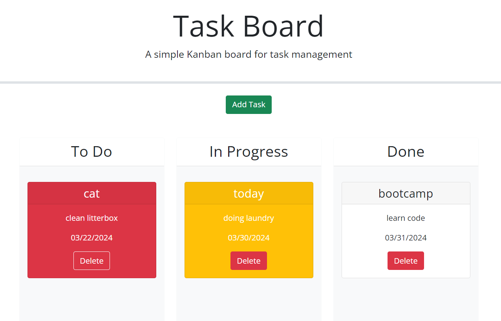
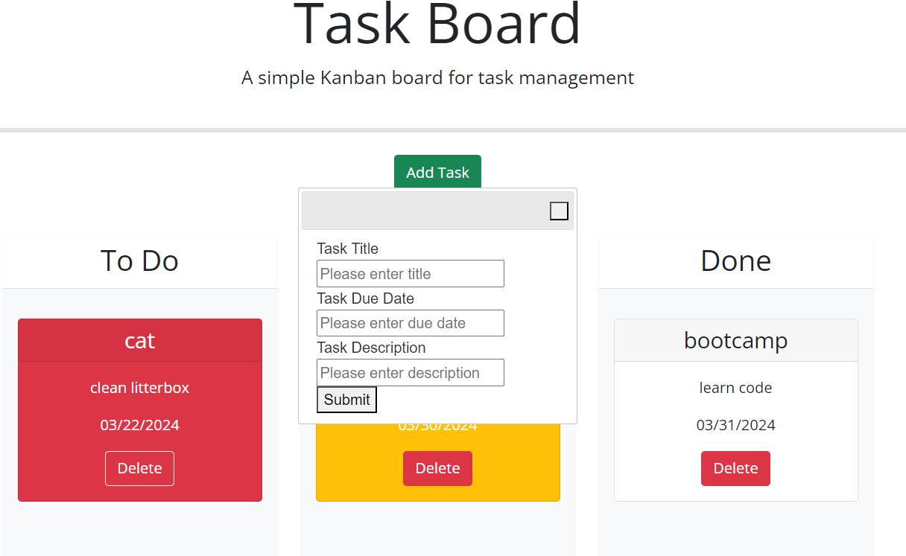

# Week 5 task board Jack Yazzie

Site to contain tasks and their due dates, sort them visually based on completion status, and color code them based on the deadline.
Uses local storage to perpetuate the task cards on the user end.

deployed site:

https://sleekwingx.github.io/week-5-challenge-task-board/

## Resources

Xpert Learning Assistant. (2024, March 22nd) https://bootcampspot.instructure.com/courses/5271/external_tools/313